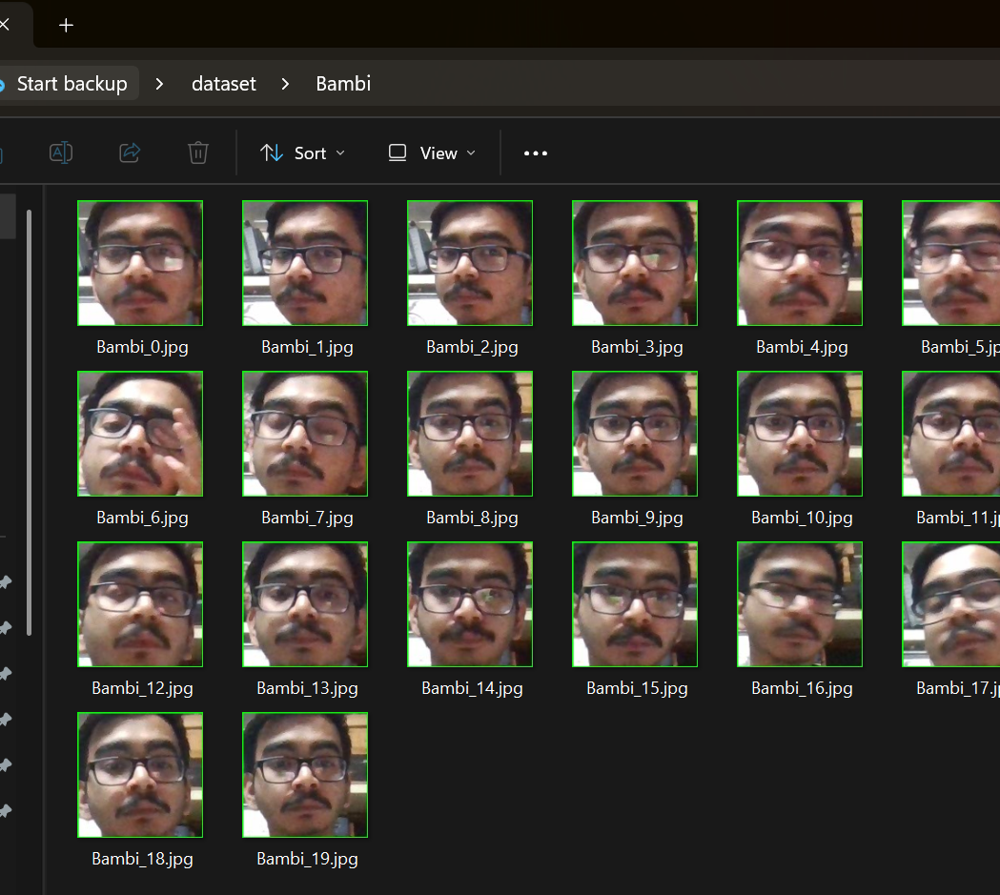

# Student Face Registration System (Haar Cascade + GUI)

A GUI-based face registration system built using OpenCV and Tkinter.  
The system captures multiple face images using a webcam and stores student details in a structured dataset for further face recognition training.

---

##  Overview

This project allows student registration through a graphical interface and:

- Captures face images using Haar Cascade
- Stores images in organized dataset folders
- Saves student metadata in a CSV file
- Supports controlled multi-angle capture
- Displays capture progress in real-time

---

## How It Works

1. User enters:
   - Student Name
   - Student ID
   - Department
   - Semester
2. Webcam starts
3. Face is detected using Haar Cascade
4. Images are captured at fixed intervals
5. Images are saved in dataset folder
6. Student details are stored in CSV file
## Result

  

